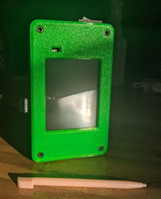

 

  <b>This repo will hold the flasher-tool to upload/flash a custom verion of <a href=hhttps://github.com/justcallmekoko/ESP32Marauder/wiki/about>Wifi Marauder</a> along with 3D files to print different cases for the CYD AKA Cheap Yellow Display. This build features a few great fixes and customzations.</b> 
  
  
   
   
  
  ## 🌟 Update Highlights 03/24/24 🌟
- **<a href=https://github.com/Fr4nkFletcher/ESP32-Marauder-Cheap-Yellow-Display/blob/master/screenshots/pwn2.jpg>Detect Pwnagotchi fix </a> in the WiFi Sniffers submenu thanks to <a href=https://github.com/Fr4nkFletcher>Fr4nkFletcher</a> for sharing your knowledge on this topic. (currently only for builds without GPS. Fix hopefully soon)**

- **Unrelated to the 0.13.9 release: SwiftPair Spam now 100% functional** (Thanks to <a href=https://github.com/Fr4nkFletcher>Fr4nkFletcher</a>)

- **<a href=https://github.com/ATOMNFT/CYD-ESP32Marauder/tree/master/Evil%20Portal%20Stuff>Evil Portal storage fix</a>** Fixed by me

 
  
  ## To install this fork of marauder
  <b>You can choose to use the CM-Box flasher tool to flash the latest version of CM-Box (Custom Marauder box) to your CYD (Micro usb only at the moment) or you can choose to build from a modified fork (CYD-ESP32Marauder) for a more hands on experince. Both options result in the same installation the second option gives you the ability to modify the files further if your comfy with that.</b>
  
  
  - **Simple Install:** <a href=https://atomnft.github.io/CM-Box/flash0.html>CM-Box flasher tool</a>
  - **Hands On Install:** <a href=https://github.com/ATOMNFT/CYD-ESP32Marauder>CYD-ESP32Marauder</a>
  

  
  ## 3D files
  <b>Head over to the <a href=https://github.com/ATOMNFT/CM-Box/tree/main/STL%20Files>3D files</a> section to download the stl files need to print the CM-Box</b>
  
  
   
  

  
  
  <b>A huge thank you goes to two wonderful people. Whom without I would have not made it as far as I  did learning.</b>  
  <b>Thanks to <a href=https://github.com/Fr4nkFletcher>Fr4nkFletcher</a> for all your guidance and late night replies.</b>
  <b>And thank you to <a href=https://github.com/smoochiee>smoochiee</a> for helping with the bootscreen and the badass tuts for building our own Marauder.</b> 
  
  
   
   
  
  
  

 