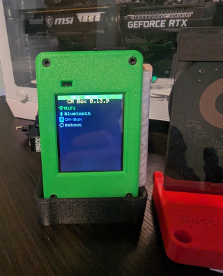

 

  

  
  ---
  <b>The flasher tool is now obsolete as JCMK has added support for the CYD into stock marauder now.</b>
     
  <b>This repo will hold the 3D files to print different cases for the CYD AKA Cheap Yellow Display.</b> 
  
   
   
  

  
  ## ⬆ Update Highlights 1/11/25 ⬆   Added New v1.2.0!
  
  | Feature/Update                             | Description/Notes                                                                                                                                                        |
|--------------------------------------------|------------------------------------------------------------------------------------------------------------------------------------------------------------------------|
| • Added logging to SD for Flipper/AirTag sniff | Thanks to Fr4nkFletcher                                                                                                                                               |
| • Added Pcap capture of flipper data       | WIP as the pcap is malformed                                                                                                                                            |
| • Added Flipper Zero Sniff                 |                                                                                                                                                                        |
| • Airtag Sniffing/Spoofing                 |                                                                                                                                                                        |
| • Working Pwnagotchi Detect on all models  |                                                                                                                                                                        |
| • Flipper BLE Spam                         |                                                                                                                                                                        |
| • Wardriving Menu added                    |                                                                                                                                                                        |
| • RGB LED enabled                          | Thanks to lsdlsd88                                                                                                                                                    |
| • Detect Pwnagotchi 100% functional        |                                                                                                                                                                        |
| • BLE/SwiftPair Spam now 100% functional   |                                                                                                                                                                        |
| • Evil Portal storage adjustment           | Moves all portals into a folder instead of root of SD card                                                                                                            |
| • External antenna information             | [Click here](https://github.com/Fr4nkFletcher/ESP32-Marauder-Cheap-Yellow-Display/blob/master/AntennaMod.md) for info on adding an external antenna.                  |

> ## 📡 **GPS Functionality** 📡
>   
>   It is fully operational via the 4-pin connector located near the MicroUSB port on the CYD module.  
> 
> 
> 🔗 [Check here](https://github.com/justcallmekoko/ESP32Marauder/wiki/gps-modification) for details on supported GPS hardware.

> ## 🛠️ **Device Compatibility**
> 
> Successfully tested on:
> - [CYD variant 1](https://amazon.com/dp/B0BVFXR313)  
> - [CYD variant 2](https://amazon.com/dp/B0CLR7MQ91)  
> 
> **✨ No hardware modifications required!**  
> This is made possible thanks to seamless integration with **[@ggaljoen](https://github.com/ggaljoen)'s** [TFT_eSPI](https://github.com/ggaljoen/TFT_eSPI) fork.

## To install this fork of marauder
 - **Simple Install (Now obsolete):** <b>You can choose to use the CM-Box flasher tool to flash the latest version of CM-Box (Custom Marauder box) to your CYD.
   <b>Flash or compile from JustCallMeKoko's links now</b>
  

### 🛠️ **Parts List**

| **Part**                      | **Description**                  | **Link**                            |
|-------------------------------|----------------------------------|------------------------------------|
| 🟡 **CYD (Cheap Yellow Display)** | Compact OLED display              | [Find it here](https://shorturl.at/GJKY4) |
| 🔌 **Rocker Switch**          | 19mm x 13mm size                | [Find it here](https://shorturl.at/oABL4) |
| 📟 **Voltmeter**              | Voltage display meter            | [Find it here](https://shorturl.at/djHY5) |
| 🔋 **Lipo Battery**           | Rechargeable power source        | [Find it here](https://rb.gy/8q9c45)      |
| 🔩 **M3x20mm Hex Head Screws** | Pack of 4 screws                 | [Find it here](https://rb.gy/lb1ewo)      |

> ---
> 
> ## 🧰 **Directions to Build the CM-Box**  
> 
> 1️⃣ Download and print the STL files located in the [3D files folder](https://github.com/ATOMNFT/CM-Box/tree/main/STL%20Files). All files are ready to print.  
> 2️⃣ Consult the **Parts List** above.  
> 3️⃣ **Build Process Coming Soon**  
>     *(Pics are being taken of a new build for reference.)*  
> 
> ---
> 
> ## 💾 **SD Setup for CM-Box**  
> 
> If you flashed from the [Custom Marauder Flasher Tool for CYD](https://atomnft.github.io/CM-Box/flash0.html)  
> or built from [CYD-ESP32Marauder](https://github.com/ATOMNFT/CYD-ESP32Marauder), you need to:  
> - Create a folder on the root of your SD card titled `portals`.  
> - Store the [Evil Portal HTML files](https://github.com/ATOMNFT/CYD-ESP32Marauder/tree/master/Evil%20Portal%20Stuff), including the `index.html` file, in this folder.  
> 
> ---
> 
> ## 📸 **Pics of Build**  
> 
> Head over to the [3D files section](https://github.com/ATOMNFT/CM-Box/tree/main/STL%20Files) to download the STL files needed to print the CM-Box.  
> *(The files are only for the 1 Micro USB version at this time.)*  
> 
>    
>    
> 
> ---
> 

## 🎉 **Shoutouts!** 📢  
 
 A huge thank you goes to two wonderful people who made learning and building this possible:  
 
 - **[Fr4nkFletcher](https://github.com/Fr4nkFletcher)** for all your guidance and late-night replies.  
 - **[Smoochiee](https://github.com/smoochiee)** for helping with the bootscreen and the badass tutorials for building Marauder.  
 
 Special thanks to the creators and supporters of the [ESP32 Cheap Yellow Display](https://github.com/witnessmenow/ESP32-Cheap-Yellow-Display) project and the community Discord, especially **@cod5fgzj** and [**ggaljoen**](https://github.com/ggaljoen).  
 
 And of course, **[JustCallMeKoko](https://github.com/justcallmekoko)** for the foundational work on ESP32 Marauder.  

  
 
 
  